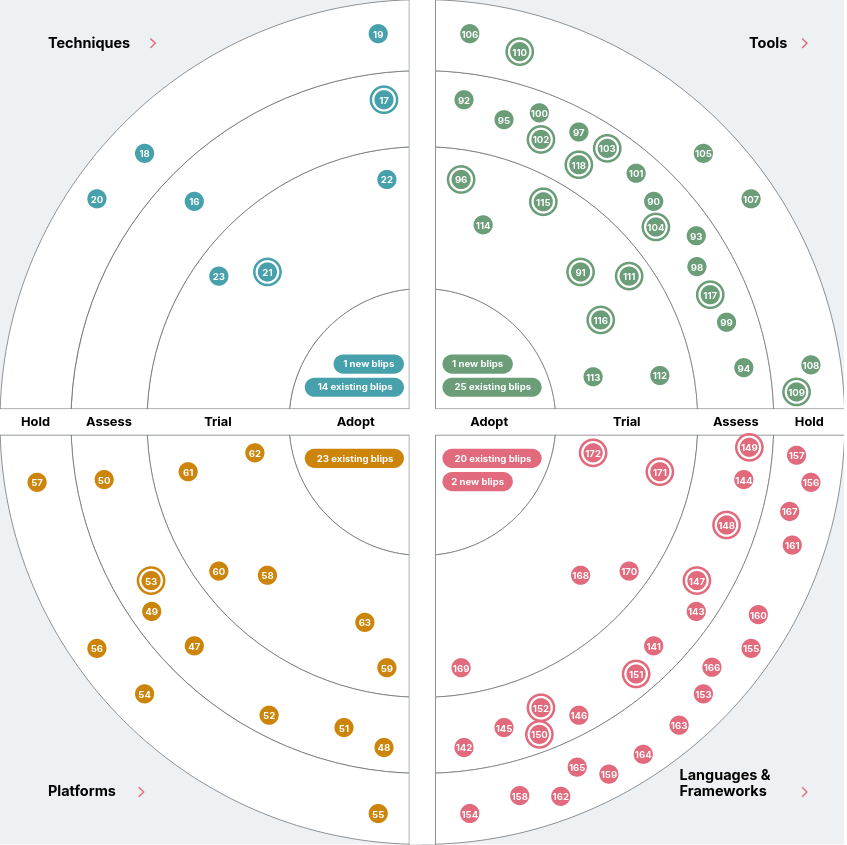
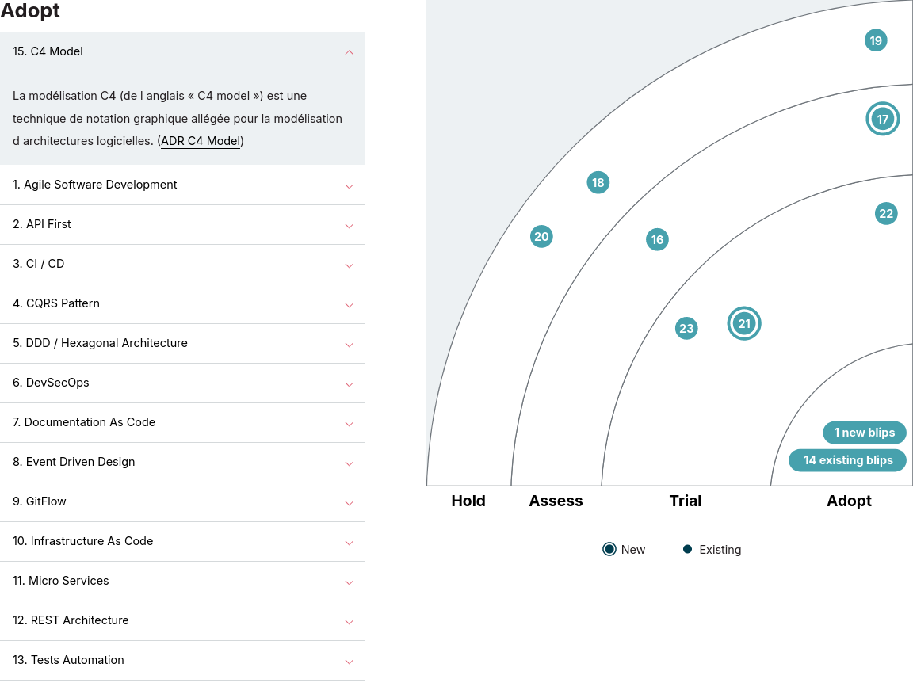

:classification: C0 - Public
:source-highlighter: pygments
:sectanchors:
:sectlinks:
:customcss: style/prez.css
:version: 1.0

[background-image=style/title-bg.png, state=title]
== 5 ans de Radar Techno 

Pour animer la communauté technique

[background-image=style/technologies.png, transition=none]
== Technologies

[%step]
[.text-left]
* L'accélération de l'innovation.
* La complexification des systèmes.
* La dépendance croissante aux technologies.

image:style/img-space.png[height=600]

[.notes]
--
Aujourd'hui les technologies évoulent sans cesse :

* L'accélération de l'innovation : les technologies informatiques évoluent à un rythme toujours plus rapide, avec l'émergence de nouvelles technologies et de nouveaux usages tous les jours.
* La complexification des systèmes : les systèmes informatiques sont de plus en plus complexes, ce qui rend plus difficile leur conception, leur développement et leur maintenance.
* La dépendance croissante aux technologies : les technologies informatiques sont devenues indispensables à de nombreux aspects de notre vie, tant personnelle que professionnelle.
--

[background-image=style/oportunity.png, transition=none]
== Opportunités

[%step]
[.text-left]
* Amélioration de l'efficacité.
* Nouveaux produits et services.
* Amélioration de l'expérience client.
* Nouvelles façons de travailler.

image:style/img-space.png[height=600]

[.notes]
--
Ceci offre de multiples opportunités :

* Amélioration de l'efficacité : les technologies informatiques peuvent aider les entreprises à améliorer leur efficacité en automatisant les tâches, en simplifiant les processus et en collectant des données en temps réel.
* Nouveaux produits et services : les technologies informatiques peuvent permettre aux entreprises de créer de nouveaux produits et services innovants qui répondent aux besoins des clients.
Amélioration de l'expérience client : les technologies informatiques peuvent aider les entreprises à améliorer l'expérience client en personnalisant les interactions et en offrant un service plus rapide et plus efficace.
* Nouvelles façons de travailler : les technologies informatiques peuvent permettre aux entreprises de créer de nouvelles façons de travailler, telles que le télétravail ou le travail collaboratif à distance.
--

[background-image=style/danger.png, transition=none]
== Risques

[%step]
[.text-left]
* Problème de maturité.
* Faiblesse de sécurité.
* Problèmes de conformité.
* Besoin de formation constante. 

image:style/img-space.png[height=600]

[.notes]
--
Celà présente également des risques et défis :

* La maturité : toutes les évolutions technologique ne sont pas pérènes dans le temps et certaines disparaissent très rapidement.
* La sécurité : les systèmes informatiques sont de plus en plus complexes et difficiles à sécuriser, ce qui les rend plus vulnérables aux attaques.
* La conformité : les entreprises doivent se conformer à un nombre croissant de réglementations, ce qui peut être difficile à gérer.
* La formation : les compétences requises pour travailler dans le domaine de l'informatique évoluent rapidement, ce qui peut poser des problèmes de recrutement et de formation. 
--

[background-image=style/radar.png, transition=none]
== Radar Technologique

[%step]
[.text-left]
* Piloter la veille & l'innovation
* Suivi de java et de son eco-système
* Favoriser le rayonnement technique
* Renforcer le conseil AVV/Clients​
* Alimenter les besoins en formation​

image:style/img-space.png[height=600]

[.notes]
--
Afin de nous aider pour tout ça nous avons mis en place, notamment sur la communauté Java de SQLI, un radar technologique, mais à quoi ça sert exactement ?

* Il s'agit essentiellement d'un outil permettant de piloter la veille et l'innovation​
* Pouvoir suivre les évolutions technologique autour de Java et de son éco-système : les frameworks, les outils​
* Favoriser les rayonnement technique grâce à notre veille et montrer que SQLI est proactif face à la technologie​
* Renforcer les conseil en proposant des nouveauté technologique car nous les auront étudiées​
* Faire émmerger de nouveaux besoin de formations au grès des apparitions technologiques : Aujourd'hui connaitre K8S semble plus utile qu'en 2017 ​

Donc ok mais comment on s'y prend ?
--

[background-image=style/slide_surveiller.png, transition=none]
== Que surveiller ?

[%step]
[.text-left]

[%step]
[.text-left]
* Techniques : Design First, DDD, Hexagonal, ...
* Outils : IntelliJ, OWASP Tools, Karaté, Sonar, ...
* Fameworks : Versions Java, Spring, Quarkus, ...
* Plateformes : Clouds, Serverless, Kubernetes, ...

image:style/img-space.png[height=600]

[.notes]
--
Alors qu'est ce que nous souhaitons surveiller ? 

* On se base sur le radar proposé par Thogh Works
* Le Radar possède 4 cadrans : Techniques, Tools, Languages & Frameworks, Platforms
* Les Techniques et les méthodologies que nous allons mettre en oeuvre en Java comme le Design First pour les APIs, Le Domain Driven Design, L'Architecture Hexagonale, et bien d'autres TDD, Clean Code, .
* Les Outils vont être tous les composants qui vont nous permettre d'être plus efficient dans le développement comme IntelliJ ou VSCode pour la partie IDE, Les Outils de l'OWASP pour la partie sécurité (Dependency Check, Top 10, ZAP Proxy), Karaté et autres outils d'automatisation de tests, Sonar et Sonarlint pour la qualité du code, ….
* Langages et Frameworks : Suivrer les dernières évolutions de Java, Savoir où on en est de Spring ou Spring Boot, l'analyse de frameworks comme Quarkus, …​
* Les plateformes vont représenter les solutions sur lesquelles nous allons déployer nos applications Le Cloud (AWS ? Azure ? GCP ? Alibaba ?) est ce qu'on sait faire du Serverless et qu'est ce que cela apporte ? À ton une maîtrise de Kubernetes ?

Nous savons ce que nous allons suivre, maintenant Comment Fait On ? 
--

[background-image=style/process.png, transition=none]
== Le process

[%step]
[.text-left]

[%step]
[.text-left]
* Assess - À l'étude (La veille technologique)
* Trial - À l'essai (L'innovation opérationnelle)
* Adopt - Standard (Le savoir faire)
* Hold - Dépréciée (Plus d'investissement)

image:style/img-space.png[height=600]

[.notes]
--
Le radar possède 4 anneaux : ASSESS, TRIAL, ADOPT, HOLD

* Lorsque nous repérons une technologie (Nouvelle pour SQLI) qui pourrait être intéressante, nous la passons en ASSESS, c'est à dire que nous allons l'étudier faire des POC pour savoir ce que cela apporte nous allons donc produire une Etude, un Rapport (nous avons fait publié plusieurs études les dernières sur Java 21, Spring Boot 3.x, ou Mockito 5.
* Si la technologie est convaincante nous allons la passer en TRIAL, c'est à dire que nous allons essayer de la mettre en oeuvre sur un premier projet (comme en son temps Java 17) afin de monteer en compétence dessus (c'est ce que j'appelle notre innovation opérationnelle, pas que nous inventions quoi que ce soit, mais nous implémentons quelque chose que nous n'avions jamais fait).
* Enfin lorsque nous avons épprouvé une première fois cette technologie, que nous avons un premier noyeau de sachants, nous pouvons la déployer à grand échelle et nous la passons donc à ADOPT, c'est le savoir faire de SQLI : et c'est ici que cela se complique un peu, en effet une Techno à Adopter ne veut pas dire que tout SQLI la maîtrise d'où le besoin de formation, ni que les clients sont forcément ok pour les mettre en place, d'ou le noyeau de sachant pour apporter du conseil.
* Il arrive qu'une technologie ne soit finalement pas convaincante, ou qu'au fil du temps elle soit un peu dépassée nous la passeront donc à Dépréciée, c'est adire que nous ne démmarerons pas de nouveaux projets avec elle, et que nous devons songer à la remplacer sur les porjets qui l'utilisent : cela fait partie de la gestion de la dette technique.
--

[background-image=style/radar.png, transition=none]
== À quoi ça ressemble ?

[%step]

[.notes]
--
Ceci est le radar du Pôle Java de SQLI France et nous pouvons y voir :

* Les quatre cadrans : Techniques, Tools, Languages & Frameworks, Platforms
* Les quatre anneaux : ASSESS, TRIAL, ADOPT, HOLD

À noter que ce radar évolue en permanence au grès des diverses études que nous pouvons mener.
--

[background-image=style/radar.png, transition=none]
== Petit Zoom

[.notes]
--
Si on zoome sur la partie Langages & Fremworks nous y retrouvons en étude et expérimentations

* Les dernières version de Java et Spring Boot par exemple
* Les spécifications Async API
* La possibilité de faire des applications natives avec Spring
--

[background-image=style/success.png, transition=none]
== Success story : Java

[%step]
[.text-left]
* 2017 : Java 6/7 peu de Java 8
* 2018 : Sortie de Java 11 non suivi
* 2019 : Un client demande Java 11
* 2020 : Suivi de toutes les versions
* 2021 : SQLI propose au client Java 17
* 2024 : Java 21 ready, Java 25 en ligne de mire

image:style/img-space.png[height=600]

[.notes]
--
Maintenant je vais vous présenter quelques petites choses qui ont étées facilités par le Radar Java SQLI.​

Lorsque je suis entré chez SQLI en 2017 la plupart de nos projets étaient en java 6 ou 7 java 8 était sorti 3 ans plus tôt.
J'ai ensuite eu la tache d'animer la communauté java en 2019 où j'ai réalisé le premier Radar. Java 11 était sorti en 2018, mais nous avions du mal a suivre les montés de versions : 
Nous avons lancé un suivi des évolutions de chaque nouvelle version, des workshops pour présenter les évolutions de Java 8 à Java 11 (fin 2019). Nous avons entammé des PMT Java 11 mais essentiellement dictés par notre client (nous n'étions pas pro actifs). 
Petit à petit nous avons étudiés les évolutions de java et finalement fin 2021 nous avons commencé à intégrer java 17 (2020), c'est SQLI qui a pris l'initiative.​
--

[background-image=style/use-cases.png, transition=none]
== Autres uses cases

[%step]
[.text-left]
* DÉVELOPPEUR(SE) : PRÉPARER SES FORMATIONS
* COMMERCIAL : DÉTECTER UNE AVV INTÉRESSANTE
* RECRUTEUR(SE) : REPÉRER UN CANDIDAT INTÉRESSANT
* EXPERT(E)/TECH LEAD : ORGANISER SA VEILLE
* CHEF(FE) DE PROJET : VÉRIFIER LA DETTE D'UN PROJET

image:style/img-space.png[height=600]

[.notes]
--
Voici maintenant quelques exemples d'utilisation du radar

* Je suis dévelopeur(se) : je peux consulter le Radar pour voir les compétences que je ne maitriserais pas (Adopt ou Trial) et demander une formation.​
* Je suis commercial(e) : J'ai un AVV avec les mots clé DDD, Quarkus, GraalVM et Kubernetes : un rapide tour me permet de voir que ce sont des technologies vers lesquelles SQLI veut aller
* Je suis recruteur(se) : J'ai un(e) candidat(e) qui possèdes des compétence en cours d'études SQLI (Assess ou Trial) il s'agit peut être d'un profil intéressant.
* Je suis Expert(e)/Tech Lead : Je veux aider la communauté, je peux sélectionner une technologie à étudier (Assess) avec l'aval de la communauté et proposer une étude sur le sujet. 
* Je suis CP : Je remarque que mon équipe n'est pas enthousiaste sue mon projet, peut être qui possèdes trop de technos à dépréciées ne pourrait on pas vendre une migration technique ?
--

[background-image=style/conclusion.png, transition=none]
== Aller plus loin

[%step]

image:style/img-space.png[height=150]

[.notes]
--
TODO
--

[background-image=style/thanks.png, transition=none]
== Merci

image:style/img-space.png[height=30]

https://github.com/darken33/radar-pointe-technologique[Retrouvez la présentation ici]

image:style/prez-radar.png[width=200]

image:style/img-space.png[height=150]

[.notes]
--
http://tinyurl.com/radar-pointe-technologique
--